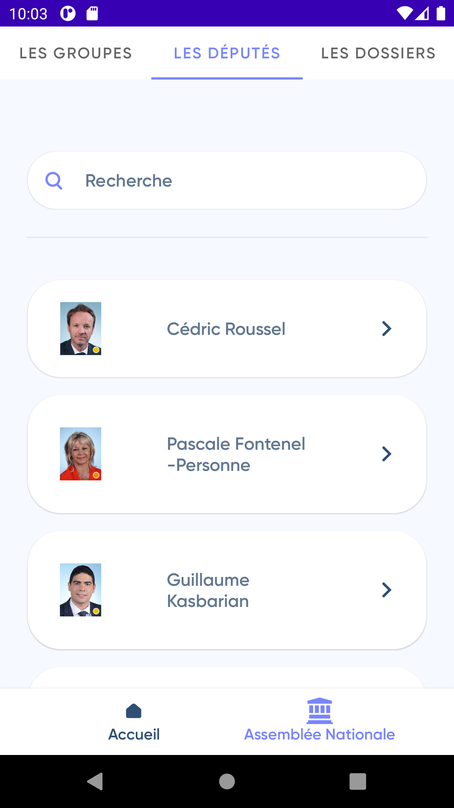
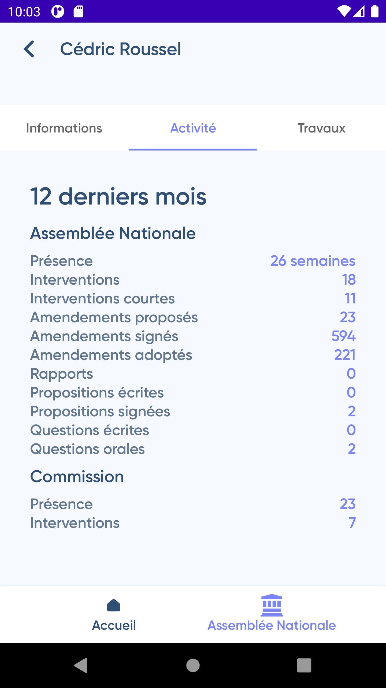

# Legi Info FR

## About

Legi Info FR is an Android application for tracking the parliamentary activities of French deputies elected to the National Assembly.
The application uses the API made available in an OpenData way by nosDeputes.fr.

## Technical Stack
* MVVM + Clean Architecture
* Retrofit
* Moshi
* Room
* Koin

## Screenshots

| Deputies list      | Deputy Information | Deputy Activity
| ------------- |:-------------:|:-------------:|
|      |  | 
